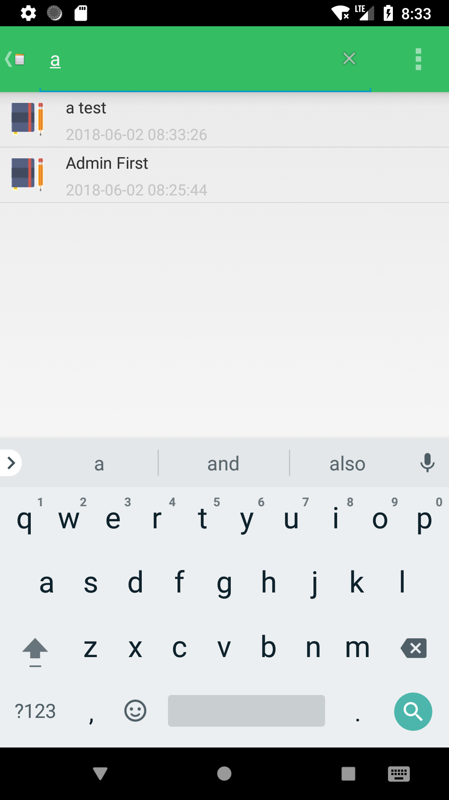

###主要实现的功能有：
* NoteList中显示条目增加时间戳显示
* 添加笔记查询功能（根据标题查询）
* 更改记事本的背景颜色
####1.NoteList中显示条目增加时间戳显示
使用System.currentTimeMillis()方法获取系统的当前时间秒数，在运用SimpleDateFormat("yyyy-MM-dd HH:mm:ss")进行格式化

####2.添加笔记查询功能（根据标题查询）
在ActionBar和添加搜索功能，首先在res/menu/中创建list_options_menu.xml文件并设置使用的图标，然后创建一个检索配置和检索的activity来获取和响应搜索请求。

####3.更改记事本的背景颜色
通过修改res/values/colors.xml文件中colorPrimary的color标签中的颜色代码改变记事本的背景颜色。